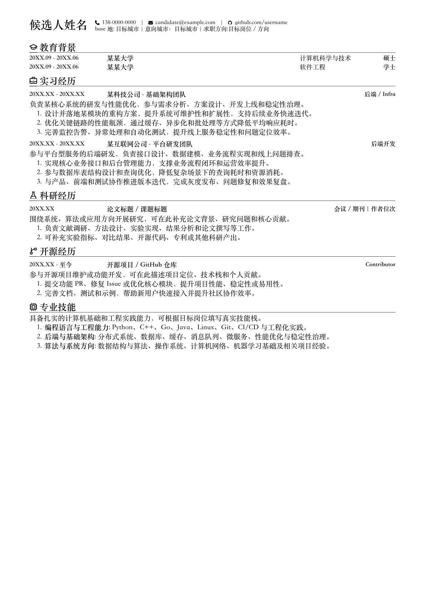
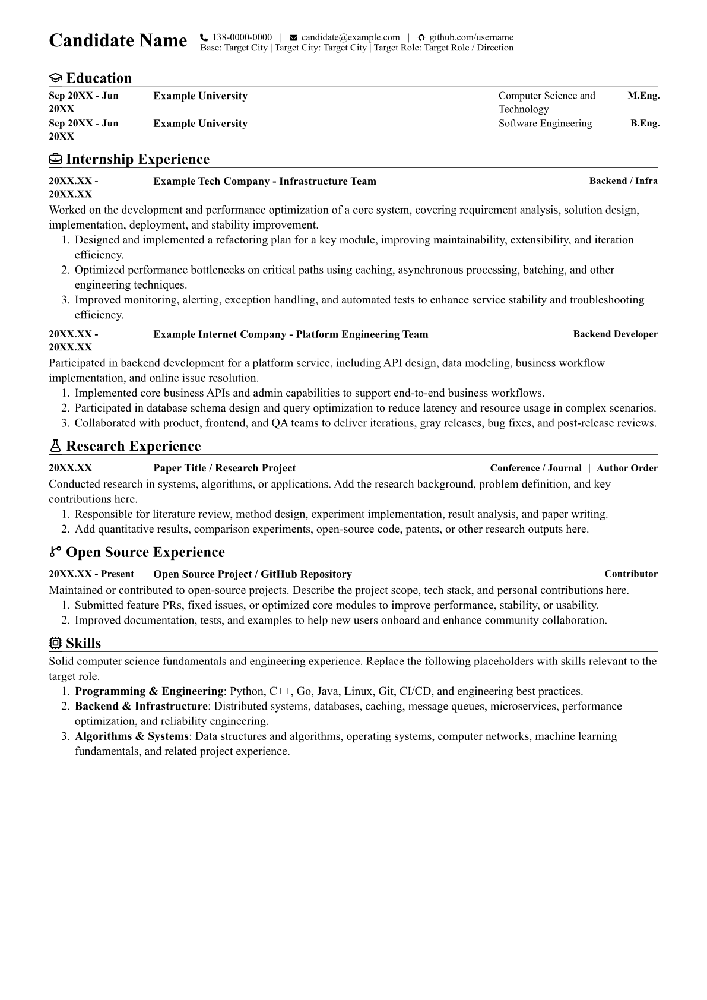

# Resume in Typst

一个简洁、严肃的 Typst 简历模板，支持中文和英文两套示例。

## 文件说明

- `template.typ`：通用简历样式模板
- `resume.typ`：中文简历示例
- `resume-en.typ`：英文简历示例
- `static/icons/`：简历中使用的图标资源
- `resume.pdf`：中文简历导出结果
- `resume-en.pdf`：英文简历导出结果

## 安装 Typst

macOS：

```bash
brew install typst
```

Arch Linux：

```bash
pacman -S typst
```

Windows / 其他平台可参考 Typst 官方安装文档：<https://github.com/typst/typst>

## 编译

生成中文 PDF：

```bash
typst compile resume.typ resume.pdf
```

生成英文 PDF：

```bash
typst compile resume-en.typ resume-en.pdf
```

生成中文 PNG：

```bash
typst compile resume.typ resume.png
```

生成英文 PNG：

```bash
typst compile resume-en.typ resume-en.png
```

## 效果预览

中文模板：



英文模板：



## 使用方式

修改 `resume.typ` 或 `resume-en.typ` 中的个人信息、教育背景、实习经历、科研经历、开源经历和专业技能即可。

头部信息示例：

```typst
#show: resume.with(
  size: 10pt,
  themeColor: black,
)[
  #info(
    color: black,
    name: "候选人姓名",
    phone: "138-0000-0000",
    email: "candidate@example.com",
    github: "github.com/username",
    location: "目标城市",
    target_role: "目标岗位 / 方向",
    target_city: "目标城市",
  )
]
```

英文模板需要设置 `language: "en"`：

```typst
#show: resume.with(
  size: 10pt,
  themeColor: black,
  language: "en",
)[
  #info(
    color: black,
    name: "Candidate Name",
    phone: "138-0000-0000",
    email: "candidate@example.com",
    github: "github.com/username",
    location: "Target City",
    target_role: "Target Role / Direction",
    target_city: "Target City",
    language: "en",
  )
]
```

## 常用块

教育经历：

```typst
#education(
  "20XX.09 - 20XX.06",
  "某某大学",
  "计算机科学与技术",
  align(right)[硕士],
)
```

经历条目：

```typst
#item([20XX.XX - 20XX.XX], [某科技公司 - 基础架构团队], align(right)[后端 / Infra])
负责某核心系统的研发与性能优化。

+ 设计并落地某模块的重构方案，提升系统可维护性和扩展性。
```

科研经历：

```typst
#research([20XX.XX], [论文标题 / 课题标题], align(right)[会议 / 期刊｜作者位次])
围绕系统、算法或应用方向开展研究。
```

## 模板参数

可在 `template.typ` 顶部调整版式：

```typst
#let time-col = 19%
#let col-gap = 1.1em
#let body-leading = 0.6em
#let text-gap = 0.6em
#let item-gap = 1em
```

- `time-col`：左侧时间列宽度
- `col-gap`：列间距
- `body-leading`：段落内部行距
- `text-gap`：段落间距
- `item-gap`：条目之间的间距

## 致谢

样式参考了以下项目：

- [liweitianux/resume](https://github.com/liweitianux/resume)
- [uniquecv](https://github.com/dyinnz/uniquecv)
- [uniquecv-typst](https://github.com/gaoachao/uniquecv-typst)
